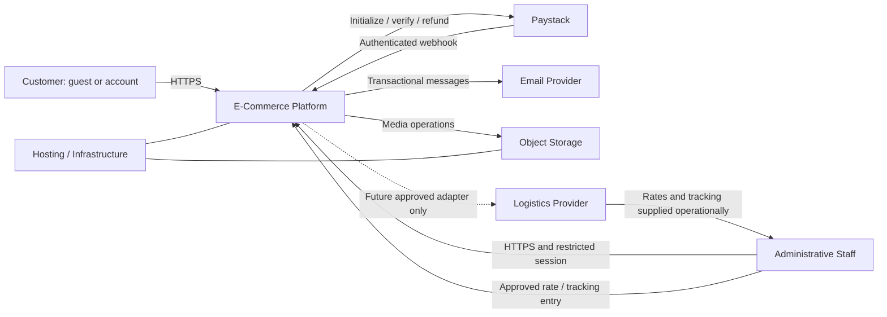

# 03 — System context
Trace: FR-INT-001, FR-PAY-001, FR-SHP-001/002, FR-NOT-001, FR-OPS-001.

Trust boundaries: (1) untrusted browser and internet to TLS edge; (2) edge to private application services; (3) application to restricted persistent stores; (4) outbound provider APIs and inbound webhooks; (5) privileged human operational access. Staff traffic is untrusted until authentication and permission/object checks complete. Provider data is untrusted until validated. Customer email is a communication channel, not proof of order ownership by itself.

The platform owns order/stock/payment application records; Paystack is the external authority for collection/refund outcome, logistics for supplied rates/tracking, and email provider for transport outcomes. A signed payment webhook still needs amount/currency/reference reconciliation.

Object storage is an infrastructure dependency, not an added client business-system integration. Q30 remains closed: no ERP, CRM, accounting, analytics or unidentified “Other” integration. Logistics is an operational dependency; a carrier API is not needed for the proposed V1 rate-table/tracking-entry design. No existing data migration is planned.
