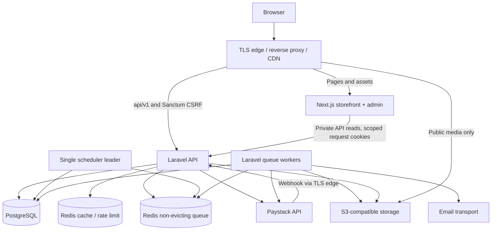

# 04 — Runtime containers and flows
Trace: NFR02/06/08/09; ADR-002/003/007/009.

Browser traffic uses one canonical origin. Edge routes API/auth/CSRF paths to Laravel; Next serves presentation routes. This avoids unnecessary cross-site cookie/CORS complexity. No Next route handler reimplements pricing, authentication or stock. Server Components may make private API reads using only the current request's required cookie and request ID; never share personalized fetch caches.

PostgreSQL persists sessions, all commerce data, webhook inbox, outbox and idempotency records. Redis caches are dispensable; its queue can be rebuilt from durable pending outbox/inbox work. Scheduler dispatches expiration, reconciliation, outbox relay and cleanup; deployment ensures one active scheduler with database-backed claim/lease safety. Workers and API share the same immutable backend release.

Order/reservation writes are one database transaction. Provider initialization follows commit. Authenticated webhook ingress durably records validated work and quickly acknowledges; workers reconcile through the common payment application action. Client polling reads the same authoritative order.

Public static assets and approved product images can use CDN caching. Account, cart, checkout, order, admin, authentication and signed/private content cannot be publicly cached. Rate/stock changes invalidate public data but every purchase checks the database. Private stores have no internet-exposed ports. See [deployment](27-deployment-architecture.md) for failure and scaling boundaries.
