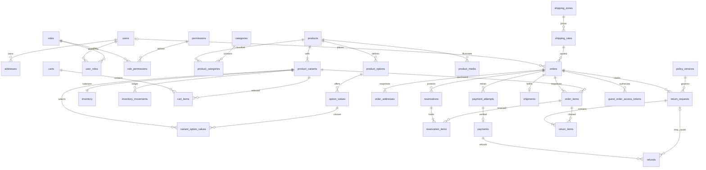
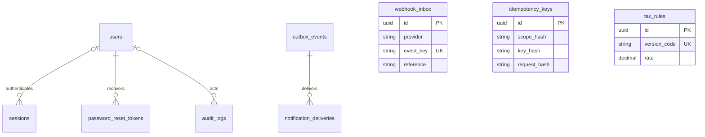

# 08 — Logical database design and ERD
**Proposed PostgreSQL 18 design, not production migrations.** Trace: NFR02/10/14/15 and V1 domain requirements. 41 tables include commerce and necessary auth/reliability infrastructure; no deferred-feature tables.

**Phase 3A physical mapping amendment (2026-09-20):** The original logical specifications below are retained for history. For executable users, sessions and password_reset_tokens only, [ADR-011](adr/011-identity-framework-storage.md) is authoritative: Laravel email/password names, string session PK and email-keyed reset storage intentionally supersede conflicting common-column/field conventions below. Other tables and business scope are unchanged.

**Phase 3D physical mapping amendment (2026-09-23):** Accepted [ADR-013 revision 2](adr/013-inventory-before-orders.md) supersedes the order-owned reservation/ledger relationships below for executable inventory storage. Implemented inventory-owned `reservation_references` replaces reservation order ownership; `reservation_items` links real variants; movements link real items with a composite variant FK. No order/cart/payment table or dangling future-order column was created. The original future-domain logical sections/ERD remain historical design context, not the current inventory DDL. Future orders must bind the real inventory reference and generation membership as specified in ADR-013. See the [implemented schema and service contract](../development/inventory.md).

## Conventions applying to every table
Each table below explicitly incorporates the common column set shown here. **N = NOT NULL; Y = nullable; — = no database default, caller must supply.** Every table has `id uuid NOT NULL PRIMARY KEY`, application-generated cryptographically strong UUID (no predictable authorization assumption), and `created_at timestamptz NOT NULL DEFAULT now()`. Mutable tables additionally have `updated_at timestamptz NOT NULL DEFAULT now()`, updated by the action; immutable tables have no updated_at. Each table says which set applies. All times are stored UTC; business calendar decisions use explicit configured timezone.

All UUID foreign-key types match referenced IDs. UQ means database unique constraint/index. Default FK behavior is **ON UPDATE RESTRICT**; delete action is specified per table. Primary/unique constraints supply their own indexes; listed additional indexes cover lookups and FKs. Where a composite FK is present, its referenced composite UQ is declared. Nullable composite references use MATCH SIMPLE intentionally (e.g. product media without variant); required same-parent relationships use nonnull columns.

Money is bigint minor units, never float. JSON API money is a decimal string. Arithmetic casts to sufficiently wide integer/decimal before multiplication and checks bounded input to prevent overflow. Exact rates use numeric. Every monetary field is nonnegative unless it is explicitly a signed inventory delta; V1 discounts are constrained to zero. A zero-price catalog item is representable but a zero-total payable order needs explicit business/payment review; absent that review, checkout rejects zero grand totals before creating an order.

String status sets below are CHECK constraints, not PostgreSQL enum types, easing controlled migrations. Every shortened rule name (qty, price, total, end, start, threshold, version, bytes) refers to the correspondingly named column in that table. CHECKs cannot enforce sums across rows: explicitly marked **action** invariants run under locks/transactions with integration/concurrency tests; no claim these are automatic FK/CHECK guarantees.

Published tax/rate configuration uses immutable versions and nonoverlapping validity. Implementation must choose a PostgreSQL range-exclusion constraint (and approved extension if necessary) or serialized publication transaction with concurrency proof. JSON snapshots are bounded, validated structured documents, not an untyped substitute for core relational fields. No full provider payload/card data is stored.

No blanket soft deletion. Catalog archival is explicit status/archived_at; orders/payments/ledger are retained. Ephemeral carts/sessions/tokens can be hard-purged; financial FKs RESTRICT. Privacy erasure uses reviewed anonymization, never cascades from user to paid order. Database runtime roles must lack update/delete on immutable ledger/audit records; a controlled retention role is separate.

## Table specifications

### users
Registered customer or staff identity (guests have no user row).

Common columns: **id (PK), created_at, updated_at**, exactly as defined above.

| Column | PostgreSQL type | Null? | Default |
|---|---|---|---|
| name | varchar(160) | N | — |
| email_normalized | varchar(254) | N | — |
| password_hash | varchar(255) | N | — |
| email_verified_at | timestamptz | Y | NULL |
| status | varchar(20) | N | 'active' |
| auth_version | integer | N | 1 |
| mfa_secret_ciphertext | text | Y | NULL |
| mfa_recovery_hashes | jsonb | Y | NULL |
| mfa_confirmed_at | timestamptz | Y | NULL |

**Constraints / indexes / FK delete behavior:** UQ(email_normalized); CHECK status IN active,disabled,anonymized; auth_version > 0. Index(status). Recovery array contains only hashed one-use codes; encryption key lives outside DB.

**Lifecycle / deletion:** Disable/anonymize through approved workflow; no implicit soft-delete filter; never cascade-delete financial history.

### roles
Named launch staff roles.

Common columns: **id (PK), created_at, updated_at**, exactly as defined above.

| Column | PostgreSQL type | Null? | Default |
|---|---|---|---|
| code | varchar(64) | N | — |
| name | varchar(120) | N | — |

**Constraints / indexes / FK delete behavior:** UQ(code). Seed only approved role identifiers; last active owner protection is transactional application invariant.

**Lifecycle / deletion:** Mutable; no soft delete. Restrict parent deletion unless explicitly stated.

### permissions
Explicit granular action identifiers.

Common columns: **id (PK), created_at, updated_at**, exactly as defined above.

| Column | PostgreSQL type | Null? | Default |
|---|---|---|---|
| code | varchar(100) | N | — |
| description | text | N | — |

**Constraints / indexes / FK delete behavior:** UQ(code). Application-owned vocabulary; no arbitrary wildcard grants.

**Lifecycle / deletion:** Mutable; no soft delete. Restrict parent deletion unless explicitly stated.

### user_roles
Audited user-to-role assignment.

Common columns: **id (PK), created_at, updated_at**, exactly as defined above.

| Column | PostgreSQL type | Null? | Default |
|---|---|---|---|
| user_id | uuid | N | — |
| role_id | uuid | N | — |
| granted_by | uuid | Y | NULL |

**Constraints / indexes / FK delete behavior:** FK user_id→users CASCADE; role_id→roles RESTRICT; granted_by→users SET NULL. UQ(user_id,role_id); index(role_id), index(granted_by).

**Lifecycle / deletion:** Hard-delete revocation allowed with audit; no soft delete.

### role_permissions
Permission grants to role.

Common columns: **id (PK), created_at, updated_at**, exactly as defined above.

| Column | PostgreSQL type | Null? | Default |
|---|---|---|---|
| role_id | uuid | N | — |
| permission_id | uuid | N | — |

**Constraints / indexes / FK delete behavior:** FK role_id→roles CASCADE; permission_id→permissions RESTRICT. UQ(role_id,permission_id); index(permission_id).

**Lifecycle / deletion:** Hard-delete grant revocation with audit.

### sessions
Server-side Laravel sessions.

Common columns: **id (PK), created_at, updated_at**, exactly as defined above.

| Column | PostgreSQL type | Null? | Default |
|---|---|---|---|
| session_id | varchar(255) | N | — |
| user_id | uuid | Y | NULL |
| payload | text | N | — |
| last_activity | bigint | N | — |
| ip_hint | varchar(64) | Y | NULL |
| user_agent_hint | varchar(255) | Y | NULL |

**Constraints / indexes / FK delete behavior:** UQ(session_id); FK user_id→users CASCADE; indexes(user_id),(last_activity); CHECK last_activity >= 0. Payload protected at rest and never exposed. Framework adapter uses session_id as lookup key; logical UUID row ID is not the cookie value.

**Lifecycle / deletion:** Ephemeral hard delete on expiry/logout/revocation; no soft delete.

### password_reset_tokens
Single-use account recovery.

Common columns: **id (PK), created_at, updated_at**, exactly as defined above.

| Column | PostgreSQL type | Null? | Default |
|---|---|---|---|
| user_id | uuid | N | — |
| token_hash | char(64) | N | — |
| expires_at | timestamptz | N | — |
| consumed_at | timestamptz | Y | NULL |

**Constraints / indexes / FK delete behavior:** FK user_id→users CASCADE; UQ(token_hash); index(user_id), index(expires_at); CHECK expires_at > created_at. Consume atomically and invalidate older active tokens.

**Lifecycle / deletion:** Ephemeral; hard purge expired/consumed records.

### addresses
Current saved addresses.

Common columns: **id (PK), created_at, updated_at**, exactly as defined above.

| Column | PostgreSQL type | Null? | Default |
|---|---|---|---|
| user_id | uuid | N | — |
| label | varchar(80) | Y | NULL |
| recipient_name | varchar(160) | N | — |
| phone | varchar(32) | N | — |
| line1 | varchar(255) | N | — |
| line2 | varchar(255) | Y | NULL |
| city | varchar(120) | N | — |
| state_code | varchar(40) | N | — |
| postal_code | varchar(20) | Y | NULL |
| country_code | char(2) | N | 'NG' |
| is_default | boolean | N | false |

**Constraints / indexes / FK delete behavior:** FK user_id→users CASCADE; CHECK country_code='NG'; partial UQ(user_id) WHERE is_default; index(user_id). Default switching locks user's address set.

**Lifecycle / deletion:** Hard-delete by owner allowed; historical order addresses independent.

### categories
Product taxonomy.

Common columns: **id (PK), created_at, updated_at**, exactly as defined above.

| Column | PostgreSQL type | Null? | Default |
|---|---|---|---|
| parent_id | uuid | Y | NULL |
| name | varchar(160) | N | — |
| slug | varchar(180) | N | — |
| status | varchar(20) | N | 'draft' |

**Constraints / indexes / FK delete behavior:** FK parent_id→categories RESTRICT; UQ(slug); index(parent_id), index(status); CHECK parent_id != id and status IN draft,active,archived. Multi-level cycle prevention in action.

**Lifecycle / deletion:** Archive referenced categories; no deleted_at.

### products
Editorial product identity.

Common columns: **id (PK), created_at, updated_at**, exactly as defined above.

| Column | PostgreSQL type | Null? | Default |
|---|---|---|---|
| name | varchar(200) | N | — |
| slug | varchar(220) | N | — |
| description | text | N | '' |
| kind | varchar(16) | N | — |
| status | varchar(16) | N | 'draft' |
| tax_category_code | varchar(64) | N | — |
| content_version | integer | N | 1 |
| published_at | timestamptz | Y | NULL |
| archived_at | timestamptz | Y | NULL |

**Constraints / indexes / FK delete behavior:** UQ(slug); CHECK kind IN simple,variant; status IN draft,published,archived; content_version > 0. Index(status,published_at). Search initially parameterized indexed normalized name/slug prefix or PostgreSQL text-search expression index, selected after sample-language review.

**Lifecycle / deletion:** Archive, no hard deletion once referenced; no generic soft-delete scope. Tax category must resolve an approved rule at checkout.

### product_categories
Category membership.

Common columns: **id (PK), created_at, updated_at**, exactly as defined above.

| Column | PostgreSQL type | Null? | Default |
|---|---|---|---|
| product_id | uuid | N | — |
| category_id | uuid | N | — |

**Constraints / indexes / FK delete behavior:** FK product_id→products CASCADE; category_id→categories RESTRICT; UQ(product_id,category_id); index(category_id,product_id).

**Lifecycle / deletion:** Membership removal allowed; product hard-delete restricted by historical FKs.

### product_options
Generic option definitions per product.

Common columns: **id (PK), created_at, updated_at**, exactly as defined above.

| Column | PostgreSQL type | Null? | Default |
|---|---|---|---|
| product_id | uuid | N | — |
| name | varchar(100) | N | — |
| position | integer | N | 0 |

**Constraints / indexes / FK delete behavior:** FK product_id→products RESTRICT; UQ(product_id,name); UQ(id,product_id); CHECK position>=0; index(product_id,position).

**Lifecycle / deletion:** Archive parent rather than delete used options.

### option_values
Named values of generic options.

Common columns: **id (PK), created_at, updated_at**, exactly as defined above.

| Column | PostgreSQL type | Null? | Default |
|---|---|---|---|
| product_id | uuid | N | — |
| option_id | uuid | N | — |
| value | varchar(120) | N | — |
| position | integer | N | 0 |

**Constraints / indexes / FK delete behavior:** Composite FK(option_id,product_id)→product_options(id,product_id) RESTRICT; UQ(option_id,value); UQ(id,option_id,product_id); CHECK position>=0; index(product_id), index(option_id,position).

**Lifecycle / deletion:** Mutable; no soft delete. Restrict parent deletion unless explicitly stated.

### product_variants
Authoritative sellable SKU and price.

Common columns: **id (PK), created_at, updated_at**, exactly as defined above.

| Column | PostgreSQL type | Null? | Default |
|---|---|---|---|
| product_id | uuid | N | — |
| sku | varchar(100) | N | — |
| option_signature | text | N | — |
| unit_price_minor | bigint | N | — |
| currency | char(3) | N | 'NGN' |
| status | varchar(16) | N | 'active' |
| price_version | integer | N | 1 |
| archived_at | timestamptz | Y | NULL |

**Constraints / indexes / FK delete behavior:** FK product_id→products RESTRICT; UQ(sku), UQ(product_id,option_signature), UQ(id,product_id). CHECK price>=0, currency='NGN', status IN active,archived, price_version>0. Index(product_id,status). Simple signature is empty; action enforces exactly one simple variant and valid complete combinations.

**Lifecycle / deletion:** Archive used SKUs; never rewrite historical order snapshots.

### variant_option_values
Selection of exactly one value per variant option.

Common columns: **id (PK), created_at, updated_at**, exactly as defined above.

| Column | PostgreSQL type | Null? | Default |
|---|---|---|---|
| product_id | uuid | N | — |
| variant_id | uuid | N | — |
| option_id | uuid | N | — |
| option_value_id | uuid | N | — |

**Constraints / indexes / FK delete behavior:** Composite FK(variant_id,product_id)→product_variants(id,product_id) RESTRICT; FK(option_value_id,option_id,product_id)→option_values(id,option_id,product_id) RESTRICT; UQ(variant_id,option_id); index(option_value_id,option_id,product_id), index(product_id). Action validates required option completeness.

**Lifecycle / deletion:** Immutable for sold combination; replace/archive variant for semantic change.

### product_media
Upload lifecycle and safe image references.

Common columns: **id (PK), created_at, updated_at**, exactly as defined above.

| Column | PostgreSQL type | Null? | Default |
|---|---|---|---|
| product_id | uuid | N | — |
| variant_id | uuid | Y | NULL |
| object_key | text | N | — |
| derivatives | jsonb | N | '{}' |
| status | varchar(20) | N | 'quarantined' |
| mime_type | varchar(80) | Y | NULL |
| byte_size | bigint | Y | NULL |
| width | integer | Y | NULL |
| height | integer | Y | NULL |
| checksum | char(64) | Y | NULL |
| alt_text | varchar(500) | N | '' |
| position | integer | N | 0 |
| retired_at | timestamptz | Y | NULL |

**Constraints / indexes / FK delete behavior:** FK product_id→products RESTRICT; composite FK(variant_id,product_id)→product_variants(id,product_id) RESTRICT (nullable variant). UQ(object_key); indexes(product_id,position),(variant_id,product_id),(status,created_at); CHECK bytes/dimensions positive if set, position>=0, status IN quarantined,processing,ready,rejected,retired; derivatives is object.

**Lifecycle / deletion:** Retire first; delayed object/metadata cleanup checks references and retention.

### inventory
One saleable stock pool per variant.

Common columns: **id (PK), created_at, updated_at**, exactly as defined above.

| Column | PostgreSQL type | Null? | Default |
|---|---|---|---|
| variant_id | uuid | N | — |
| on_hand | integer | N | 0 |
| reserved | integer | N | 0 |
| low_stock_threshold | integer | N | 0 |
| version | bigint | N | 1 |

**Constraints / indexes / FK delete behavior:** FK variant_id→product_variants RESTRICT; UQ(variant_id); CHECK on_hand>=0, reserved>=0, reserved<=on_hand, threshold>=0, version>0. No stored available column; derive on_hand-reserved. Index derived availability only if profiling supports it.

**Lifecycle / deletion:** No deletes; balances mutate only with atomic ledger entries.

### carts
Persistent guest/account selection.

Common columns: **id (PK), created_at, updated_at**, exactly as defined above.

| Column | PostgreSQL type | Null? | Default |
|---|---|---|---|
| user_id | uuid | Y | NULL |
| guest_token_hash | char(64) | Y | NULL |
| status | varchar(16) | N | 'active' |
| version | integer | N | 1 |
| expires_at | timestamptz | N | — |

**Constraints / indexes / FK delete behavior:** FK user_id→users RESTRICT; CHECK exactly one of user_id/guest_token_hash present, status IN active,converted,expired,merged, version>0; UQ(guest_token_hash); partial UQ(user_id) WHERE status='active'; indexes(expires_at),(status,updated_at).

**Lifecycle / deletion:** Purge expired/retired carts after retention and unlink order.cart_id; no financial history cascade.

### cart_items
Desired quantities, no authoritative prices.

Common columns: **id (PK), created_at, updated_at**, exactly as defined above.

| Column | PostgreSQL type | Null? | Default |
|---|---|---|---|
| cart_id | uuid | N | — |
| variant_id | uuid | N | — |
| quantity | integer | N | — |

**Constraints / indexes / FK delete behavior:** FK cart_id→carts CASCADE; variant_id→product_variants RESTRICT; UQ(cart_id,variant_id); index(variant_id); CHECK quantity>0; application upper bound.

**Lifecycle / deletion:** Hard-delete item removal/expired cart.

### tax_rules
Immutable effective-dated tax calculation configuration.

Common columns: **id (PK), created_at; no updated_at**, exactly as defined above.

| Column | PostgreSQL type | Null? | Default |
|---|---|---|---|
| version_code | varchar(80) | N | — |
| category_code | varchar(64) | N | — |
| country_code | char(2) | N | 'NG' |
| rate | numeric(12,9) | N | — |
| shipping_taxable | boolean | N | — |
| rounding_policy | varchar(64) | N | — |
| treatment_label | varchar(120) | N | — |
| effective_from | timestamptz | N | — |
| effective_to | timestamptz | Y | NULL |
| approved_by | uuid | N | — |

**Constraints / indexes / FK delete behavior:** FK approved_by→users RESTRICT; UQ(version_code); indexes(category_code,country_code,effective_from),(approved_by); CHECK country='NG', 0<=rate AND rate<=1, end>start if set. Publish action locks category/scope and prevents overlapping validity; production migration should implement range exclusion or equivalent serialization with test.

**Lifecycle / deletion:** Append new version; validity closure audited; no delete if snapshotted.

### shipping_zones
Configured Nigerian destination matching.

Common columns: **id (PK), created_at, updated_at**, exactly as defined above.

| Column | PostgreSQL type | Null? | Default |
|---|---|---|---|
| code | varchar(64) | N | — |
| name | varchar(160) | N | — |
| state_code | varchar(40) | N | — |
| locality_code | varchar(120) | Y | NULL |
| active | boolean | N | true |

**Constraints / indexes / FK delete behavior:** UQ(code); UQ NULLS NOT DISTINCT(state_code,locality_code); index(state_code,active). Exact locality overrides explicitly designated state-wide fallback; ambiguous match rejected.

**Lifecycle / deletion:** Deactivate; retain rates/order snapshots.

### shipping_rates
Versioned logistics-supplied rate.

Common columns: **id (PK), created_at; no updated_at**, exactly as defined above.

| Column | PostgreSQL type | Null? | Default |
|---|---|---|---|
| zone_id | uuid | N | — |
| version_code | varchar(80) | N | — |
| provider_label | varchar(160) | N | — |
| service_code | varchar(64) | N | — |
| amount_minor | bigint | N | — |
| currency | char(3) | N | 'NGN' |
| source_reference | text | N | — |
| effective_from | timestamptz | N | — |
| effective_to | timestamptz | Y | NULL |
| approved_by | uuid | N | — |

**Constraints / indexes / FK delete behavior:** FK zone_id→shipping_zones RESTRICT; approved_by→users RESTRICT; UQ(version_code); indexes(zone_id,service_code,effective_from),(approved_by); CHECK amount>=0, currency='NGN', end>start if set. Non-overlap per zone/service enforced as tax versions; quote stores exact version.

**Lifecycle / deletion:** Append new versions, controlled validity closure; no deletion of referenced rate.

### orders
Immutable commercial order and controlled fulfillment state.

Common columns: **id (PK), created_at, updated_at**, exactly as defined above.

| Column | PostgreSQL type | Null? | Default |
|---|---|---|---|
| public_reference | varchar(64) | N | — |
| user_id | uuid | Y | NULL |
| cart_id | uuid | Y | NULL |
| contact_email | varchar(254) | N | — |
| status | varchar(24) | N | 'PENDING_PAYMENT' |
| financial_hold | boolean | N | false |
| review_reason | varchar(100) | Y | NULL |
| currency | char(3) | N | 'NGN' |
| items_net_minor | bigint | N | — |
| discount_minor | bigint | N | 0 |
| item_tax_minor | bigint | N | — |
| shipping_net_minor | bigint | N | — |
| shipping_tax_minor | bigint | N | — |
| grand_total_minor | bigint | N | — |
| shipping_rate_id | uuid | N | — |
| shipping_snapshot | jsonb | N | — |
| calculation_policy_version | varchar(80) | N | — |
| quote_fingerprint | char(64) | N | — |
| version | bigint | N | 1 |
| paid_at | timestamptz | Y | NULL |
| cancelled_at | timestamptz | Y | NULL |

**Constraints / indexes / FK delete behavior:** FK user_id→users RESTRICT; cart_id→carts SET NULL; shipping_rate_id→shipping_rates RESTRICT. UQ(public_reference); UQ(cart_id) for nonnull cart. Indexes(user_id,created_at,id),(status,created_at),(paid_at),(shipping_rate_id). CHECK all money>=0, discount=0 V1, currency='NGN', total=items_net+item_tax+shipping_net+shipping_tax, version>0, status IN PENDING_PAYMENT,PAID,PROCESSING,SHIPPED,DELIVERED,PAYMENT_REVIEW,CANCELLED. Cross-table line sums enforced by locked placement action and integrity tests.

**Lifecycle / deletion:** No delete/soft delete. Personal fields anonymized only by approved retention workflow; monetary snapshots immutable.

### order_items
Historical purchase line snapshots.

Common columns: **id (PK), created_at; no updated_at**, exactly as defined above.

| Column | PostgreSQL type | Null? | Default |
|---|---|---|---|
| order_id | uuid | N | — |
| variant_id | uuid | N | — |
| product_name | varchar(200) | N | — |
| sku | varchar(100) | N | — |
| option_snapshot | jsonb | N | '[]' |
| quantity | integer | N | — |
| unit_price_minor | bigint | N | — |
| discount_minor | bigint | N | 0 |
| net_minor | bigint | N | — |
| tax_minor | bigint | N | — |
| line_total_minor | bigint | N | — |
| tax_snapshot | jsonb | N | — |

**Constraints / indexes / FK delete behavior:** FK order_id→orders RESTRICT; variant_id→product_variants RESTRICT; UQ(order_id,variant_id); UQ(id,order_id); indexes(variant_id,order_id). CHECK qty>0, money>=0, discount=0 V1, net=qty*unit_price-discount, total=net+tax; options array, tax object. Tax snapshot includes basis/rate/rule version/rounding; no mutable rule dereference for historic rendering.

**Lifecycle / deletion:** Append-only commercial fields; no delete/soft delete.

### order_addresses
Historical shipping/billing destination.

Common columns: **id (PK), created_at; no updated_at**, exactly as defined above.

| Column | PostgreSQL type | Null? | Default |
|---|---|---|---|
| order_id | uuid | N | — |
| kind | varchar(16) | N | — |
| recipient_name | varchar(160) | N | — |
| phone | varchar(32) | N | — |
| line1 | varchar(255) | N | — |
| line2 | varchar(255) | Y | NULL |
| city | varchar(120) | N | — |
| state_code | varchar(40) | N | — |
| postal_code | varchar(20) | Y | NULL |
| country_code | char(2) | N | 'NG' |

**Constraints / indexes / FK delete behavior:** FK order_id→orders RESTRICT; UQ(order_id,kind); CHECK kind IN shipping,billing and country='NG'. One shipping address required by order-placement action; no saved-address FK.

**Lifecycle / deletion:** Immutable until approved personal-data anonymization; no delete/soft delete.

### guest_order_access_tokens
One-time order proof and resulting scoped guest session.

Common columns: **id (PK), created_at, updated_at**, exactly as defined above.

| Column | PostgreSQL type | Null? | Default |
|---|---|---|---|
| order_id | uuid | N | — |
| token_hash | char(64) | N | — |
| scope | varchar(64) | N | — |
| expires_at | timestamptz | N | — |
| consumed_at | timestamptz | Y | NULL |
| grant_hash | char(64) | Y | NULL |
| grant_expires_at | timestamptz | Y | NULL |
| revoked_at | timestamptz | Y | NULL |

**Constraints / indexes / FK delete behavior:** FK order_id→orders RESTRICT; UQ(token_hash); UQ(grant_hash); indexes(order_id),(expires_at),(grant_expires_at); CHECK expiry>created_at, grant hash/expiry both null or both nonnull, grant requires consumed_at. Scope allowlisted order read/return commands, not arbitrary permissions.

**Lifecycle / deletion:** Ephemeral hashes only; purge expired/revoked per security retention.

### reservations
A generation of order stock protection.

Common columns: **id (PK), created_at, updated_at**, exactly as defined above.

| Column | PostgreSQL type | Null? | Default |
|---|---|---|---|
| order_id | uuid | N | — |
| generation | integer | N | — |
| status | varchar(16) | N | 'ACTIVE' |
| expires_at | timestamptz | N | — |
| closed_at | timestamptz | Y | NULL |

**Constraints / indexes / FK delete behavior:** FK order_id→orders RESTRICT; UQ(order_id,generation); UQ(id,order_id); partial UQ(order_id) WHERE status='ACTIVE'; indexes(status,expires_at). CHECK generation>0, expires_at>created_at, status IN ACTIVE,COMMITTED,RELEASED,EXPIRED; terminal status iff closed_at nonnull. Effective expiry also checked from clock, not status alone.

**Lifecycle / deletion:** No deletion while retained ledger/order; terminal generation immutable.

### reservation_items
Quantity protected per order line.

Common columns: **id (PK), created_at; no updated_at**, exactly as defined above.

| Column | PostgreSQL type | Null? | Default |
|---|---|---|---|
| order_id | uuid | N | — |
| reservation_id | uuid | N | — |
| order_item_id | uuid | N | — |
| quantity | integer | N | — |

**Constraints / indexes / FK delete behavior:** FK(reservation_id,order_id)→reservations(id,order_id) RESTRICT; FK(order_item_id,order_id)→order_items(id,order_id) RESTRICT; UQ(reservation_id,order_item_id); indexes(order_item_id,order_id),(order_id); CHECK qty>0. Action enforces qty equals corresponding order line for V1 full-order reservation.

**Lifecycle / deletion:** Append-only; no delete/soft delete.

### inventory_movements
Append-only balance and reservation ledger.

Common columns: **id (PK), created_at; no updated_at**, exactly as defined above.

| Column | PostgreSQL type | Null? | Default |
|---|---|---|---|
| variant_id | uuid | N | — |
| order_id | uuid | Y | NULL |
| actor_user_id | uuid | Y | NULL |
| operation_key | varchar(180) | N | — |
| kind | varchar(24) | N | — |
| on_hand_delta | integer | N | 0 |
| reserved_delta | integer | N | 0 |
| on_hand_after | integer | N | — |
| reserved_after | integer | N | — |
| reason | text | N | — |

**Constraints / indexes / FK delete behavior:** FK variant_id→product_variants RESTRICT; order_id→orders RESTRICT; actor_user_id→users RESTRICT. UQ(operation_key); indexes(variant_id,created_at,id),(order_id),(actor_user_id). CHECK balances nonnegative/reserved_after<=on_hand_after; at least one delta nonzero; kind IN OPENING,RESERVE,RELEASE,SALE,ADJUSTMENT,RESTOCK. Action enforces sign/effect by kind and balance consistency; DB checks cannot sum ledger safely alone.

**Lifecycle / deletion:** Append only, application cannot update/delete; compensating entries for corrections.

### payment_attempts
Recoverable provider initiation/reference.

Common columns: **id (PK), created_at, updated_at**, exactly as defined above.

| Column | PostgreSQL type | Null? | Default |
|---|---|---|---|
| order_id | uuid | N | — |
| provider | varchar(32) | N | 'paystack' |
| reference | varchar(120) | N | — |
| expected_amount_minor | bigint | N | — |
| currency | char(3) | N | 'NGN' |
| status | varchar(20) | N | 'INITIALIZING' |
| authorization_url_ciphertext | text | Y | NULL |
| provider_status | varchar(80) | Y | NULL |
| last_checked_at | timestamptz | Y | NULL |
| next_check_at | timestamptz | Y | NULL |
| failure_code | varchar(80) | Y | NULL |

**Constraints / indexes / FK delete behavior:** FK order_id→orders RESTRICT; UQ(provider,reference); UQ(id,order_id); partial UQ(order_id) WHERE status IN ('INITIALIZING','PENDING','UNKNOWN'); indexes(order_id,created_at),(status,next_check_at). CHECK amount>0, currency='NGN', status IN INITIALIZING,PENDING,SUCCEEDED,FAILED,UNKNOWN. Zero payable total requires reviewed separate handling; cannot initialize a zero charge.

**Lifecycle / deletion:** No delete; initialization secret URL purged after expiry; attempts never silently create new order.

### payments
Verified provider receipts including unapplied exceptions.

Common columns: **id (PK), created_at, updated_at**, exactly as defined above.

| Column | PostgreSQL type | Null? | Default |
|---|---|---|---|
| order_id | uuid | N | — |
| attempt_id | uuid | N | — |
| provider | varchar(32) | N | — |
| provider_transaction_id | varchar(120) | N | — |
| provider_reference | varchar(120) | N | — |
| received_amount_minor | bigint | N | — |
| currency | char(3) | N | — |
| channel | varchar(40) | N | — |
| verified_at | timestamptz | N | — |
| applied_at | timestamptz | Y | NULL |
| exception_code | varchar(80) | Y | NULL |

**Constraints / indexes / FK delete behavior:** FK(order_id)→orders RESTRICT; FK(attempt_id,order_id)→payment_attempts(id,order_id) RESTRICT; UQ(provider,provider_transaction_id); UQ(provider,provider_reference); partial UQ(order_id) WHERE applied_at IS NOT NULL; indexes(attempt_id,order_id),(verified_at),(exception_code). CHECK received_amount>=0; applied receipt must have currency='NGN' and exception_code null; action matches exact expected total/ref. Mismatched currency can be retained unapplied; normalize minor-unit semantics by provider currency before comparison.

**Lifecycle / deletion:** Receipt facts append-only; controlled one-time applied_at/exception resolution mutation audited; no delete.

### webhook_inbox
Durable authenticated incoming events, including unmatched references.

Common columns: **id (PK), created_at, updated_at**, exactly as defined above.

| Column | PostgreSQL type | Null? | Default |
|---|---|---|---|
| provider | varchar(32) | N | — |
| event_key | varchar(180) | N | — |
| payload_hash | char(64) | N | — |
| normalized_payload | jsonb | N | — |
| reference | varchar(120) | Y | NULL |
| status | varchar(16) | N | 'PENDING' |
| attempts | integer | N | 0 |
| next_attempt_at | timestamptz | Y | NULL |
| lease_until | timestamptz | Y | NULL |
| processed_at | timestamptz | Y | NULL |
| error_code | varchar(80) | Y | NULL |

**Constraints / indexes / FK delete behavior:** UQ(provider,event_key); indexes(status,next_attempt_at),(provider,reference); CHECK attempts>=0, status IN PENDING,PROCESSING,DONE,QUARANTINED,FAILED. Normalized payload only required fields; no FK for unmatched reference. Do not retain raw card/secret material.

**Lifecycle / deletion:** Bounded payload retention after reconciliation; dedupe identity retained per payment policy.

### shipments
One shipment per order and tracking.

Common columns: **id (PK), created_at, updated_at**, exactly as defined above.

| Column | PostgreSQL type | Null? | Default |
|---|---|---|---|
| order_id | uuid | N | — |
| provider_label | varchar(160) | N | — |
| tracking_number | varchar(160) | Y | NULL |
| tracking_url | text | Y | NULL |
| status | varchar(16) | N | 'PREPARED' |
| shipped_at | timestamptz | Y | NULL |
| delivered_at | timestamptz | Y | NULL |
| recorded_by | uuid | N | — |
| delivery_evidence | jsonb | Y | NULL |

**Constraints / indexes / FK delete behavior:** FK order_id→orders RESTRICT; recorded_by→users RESTRICT; UQ(order_id); indexes(status,shipped_at),(recorded_by); CHECK status IN PREPARED,SHIPPED,DELIVERED; shipped state requires shipped_at and tracking number or URL; delivered requires delivered_at>=shipped_at. URL host/scheme validated in action.

**Lifecycle / deletion:** No deletion; corrections audited; tracking does not authorize access.

### policy_versions
Approved configurable return/privacy/terms policy references.

Common columns: **id (PK), created_at; no updated_at**, exactly as defined above.

| Column | PostgreSQL type | Null? | Default |
|---|---|---|---|
| kind | varchar(24) | N | — |
| version_code | varchar(80) | N | — |
| configuration | jsonb | N | — |
| content_reference | text | N | — |
| effective_from | timestamptz | N | — |
| approved_by | uuid | N | — |

**Constraints / indexes / FK delete behavior:** FK approved_by→users RESTRICT; UQ(kind,version_code); indexes(kind,effective_from),(approved_by); CHECK kind IN returns,privacy,terms; configuration object. Return configuration validated against explicit schema/approved clock.

**Lifecycle / deletion:** Append-only approved versions; no delete when referenced.

### return_requests
Eligible guest/account claims and review.

Common columns: **id (PK), created_at, updated_at**, exactly as defined above.

| Column | PostgreSQL type | Null? | Default |
|---|---|---|---|
| order_id | uuid | N | — |
| requested_by | uuid | Y | NULL |
| policy_version_id | uuid | N | — |
| status | varchar(20) | N | 'SUBMITTED' |
| reason_code | varchar(24) | N | — |
| customer_note | text | Y | NULL |
| anchor_at | timestamptz | N | — |
| cutoff_at | timestamptz | N | — |
| submitted_at | timestamptz | N | — |
| decided_by | uuid | Y | NULL |
| decided_at | timestamptz | Y | NULL |
| decision_reason | text | Y | NULL |

**Constraints / indexes / FK delete behavior:** FK order_id→orders RESTRICT; requested_by/decided_by→users RESTRICT; policy_version_id→policy_versions RESTRICT; UQ(id,order_id); indexes(order_id,submitted_at),(status,submitted_at),(requested_by),(decided_by),(policy_version_id). CHECK status IN SUBMITTED,UNDER_REVIEW,APPROVED,REJECTED,RECEIVED,CLOSED; reason IN DAMAGED,WRONG_ITEM,DEFECTIVE; cutoff>=anchor. Eligibility uses submission time and approved policy, not created_at alone.

**Lifecycle / deletion:** No deletion; personal text/evidence retention controlled.

### return_items
Claimed order-line quantities and disposition.

Common columns: **id (PK), created_at, updated_at**, exactly as defined above.

| Column | PostgreSQL type | Null? | Default |
|---|---|---|---|
| order_id | uuid | N | — |
| return_request_id | uuid | N | — |
| order_item_id | uuid | N | — |
| quantity | integer | N | — |
| received_quantity | integer | N | 0 |
| restocked_quantity | integer | N | 0 |
| disposition | varchar(24) | Y | NULL |
| evidence_keys | jsonb | N | '[]' |

**Constraints / indexes / FK delete behavior:** FK(return_request_id,order_id)→return_requests(id,order_id) RESTRICT; FK(order_item_id,order_id)→order_items(id,order_id) RESTRICT; UQ(return_request_id,order_item_id); indexes(order_item_id,order_id),(order_id); CHECK quantity>0, 0<=restocked<=received<=quantity; evidence array; disposition null or SALEABLE,DAMAGED,QUARANTINED,DISPOSED. Order-line lock enforces cumulative claims/restocks across requests.

**Lifecycle / deletion:** No deletion; evidence objects private and separately retained.

### refunds
Owner-approved financial intents and provider outcomes.

Common columns: **id (PK), created_at, updated_at**, exactly as defined above.

| Column | PostgreSQL type | Null? | Default |
|---|---|---|---|
| payment_id | uuid | N | — |
| return_request_id | uuid | Y | NULL |
| merchant_reference | varchar(120) | N | — |
| provider_refund_id | varchar(120) | Y | NULL |
| amount_minor | bigint | N | — |
| currency | char(3) | N | — |
| allocation_snapshot | jsonb | N | — |
| reason | text | N | — |
| approved_by | uuid | N | — |
| approved_at | timestamptz | N | — |
| status | varchar(16) | N | 'APPROVED' |
| submitted_at | timestamptz | Y | NULL |
| completed_at | timestamptz | Y | NULL |
| next_check_at | timestamptz | Y | NULL |
| error_code | varchar(80) | Y | NULL |

**Constraints / indexes / FK delete behavior:** FK payment_id→payments RESTRICT; return_request_id→return_requests RESTRICT; approved_by→users RESTRICT; UQ(merchant_reference); UQ(provider_refund_id); indexes(payment_id,status),(status,next_check_at),(return_request_id),(approved_by). CHECK amount>0, status IN APPROVED,SUBMITTING,PENDING,SUCCEEDED,FAILED,UNKNOWN; allocation object. Locked action enforces same order for return/payment, currency matches receipt, allocation sum=amount, pending+successful sum<=receipt. Wrong-currency exception refund requires explicit provider/owner review; never implicitly convert.

**Lifecycle / deletion:** No deletion; immutable approved amount/allocation; state changes audited.

### outbox_events
Atomic domain event handoff.

Common columns: **id (PK), created_at, updated_at**, exactly as defined above.

| Column | PostgreSQL type | Null? | Default |
|---|---|---|---|
| aggregate_type | varchar(80) | N | — |
| aggregate_id | uuid | N | — |
| aggregate_version | bigint | N | — |
| event_type | varchar(100) | N | — |
| payload | jsonb | N | — |
| request_id | varchar(100) | N | — |
| status | varchar(16) | N | 'PENDING' |
| attempts | integer | N | 0 |
| available_at | timestamptz | N | now() |
| lease_until | timestamptz | Y | NULL |
| completed_at | timestamptz | Y | NULL |

**Constraints / indexes / FK delete behavior:** UQ(aggregate_type,aggregate_id,aggregate_version,event_type); index(status,available_at); CHECK version>0, attempts>=0, status IN PENDING,PROCESSING,DONE,FAILED. Polymorphic aggregate has no FK; creation is in aggregate transaction. Payload is minimal versioned object.

**Lifecycle / deletion:** Purge completed payload only after all intended consumers complete and approved retention; durable business effect keys remain.

### notification_deliveries
Unique logical email intent and delivery result.

Common columns: **id (PK), created_at, updated_at**, exactly as defined above.

| Column | PostgreSQL type | Null? | Default |
|---|---|---|---|
| outbox_event_id | uuid | N | — |
| template_code | varchar(80) | N | — |
| template_version | varchar(40) | N | — |
| recipient_hash | char(64) | N | — |
| recipient_ciphertext | text | N | — |
| provider_message_id | varchar(160) | Y | NULL |
| status | varchar(16) | N | 'PENDING' |
| attempts | integer | N | 0 |
| next_attempt_at | timestamptz | Y | NULL |
| sent_at | timestamptz | Y | NULL |
| error_code | varchar(80) | Y | NULL |

**Constraints / indexes / FK delete behavior:** FK outbox_event_id→outbox_events RESTRICT; UQ(outbox_event_id,template_code,recipient_hash); UQ(provider_message_id); indexes(status,next_attempt_at); CHECK attempts>=0, status IN PENDING,SENDING,SENT,UNKNOWN,FAILED,BOUNCED. Recipient hash keyed to limit email guessing.

**Lifecycle / deletion:** Recipient ciphertext purged per policy; logical dedupe retained; no soft delete.

### idempotency_keys
Caller-scoped request replay protection.

Common columns: **id (PK), created_at, updated_at**, exactly as defined above.

| Column | PostgreSQL type | Null? | Default |
|---|---|---|---|
| scope_hash | char(64) | N | — |
| key_hash | char(64) | N | — |
| request_hash | char(64) | N | — |
| status | varchar(16) | N | 'PROCESSING' |
| resource_type | varchar(80) | Y | NULL |
| resource_id | uuid | Y | NULL |
| response_code | integer | Y | NULL |
| response_body | jsonb | Y | NULL |
| lease_until | timestamptz | Y | NULL |
| expires_at | timestamptz | N | — |

**Constraints / indexes / FK delete behavior:** UQ(scope_hash,key_hash); index(expires_at); CHECK status IN PROCESSING,COMPLETED,FAILED; expiry>created_at; response code 100..599 if set. Scope covers actor/method/path; resource polymorphic, no FK. Store minimal replay-safe body, never credentials.

**Lifecycle / deletion:** Purge after agreed retry horizon; permanent commerce uniqueness handles later duplicates.

### audit_logs
Append-only business/security accountability.

Common columns: **id (PK), created_at; no updated_at**, exactly as defined above.

| Column | PostgreSQL type | Null? | Default |
|---|---|---|---|
| actor_user_id | uuid | Y | NULL |
| actor_type | varchar(24) | N | — |
| actor_reference | varchar(120) | Y | NULL |
| action | varchar(120) | N | — |
| subject_type | varchar(80) | N | — |
| subject_id | uuid | Y | NULL |
| outcome | varchar(24) | N | — |
| reason | text | Y | NULL |
| changes | jsonb | N | '{}' |
| request_id | varchar(100) | N | — |
| occurred_at | timestamptz | N | now() |

**Constraints / indexes / FK delete behavior:** FK actor_user_id→users RESTRICT; indexes(subject_type,subject_id,occurred_at),(actor_user_id,occurred_at),(action,occurred_at),(request_id). CHECK actor_type IN user,guest,service,anonymous; changes object. Polymorphic subject may be non-row security event, so no subject FK.

**Lifecycle / deletion:** Append-only; no application update/delete; retention under privileged audited procedure.

## Cross-table integrity and transaction rules
- Order placement checks every item total, item-sum/order totals, shipping/tax snapshot, destination and quote fingerprint while locking current price/configuration. Order financial fields and items/addresses are immutable thereafter.
- Single active reservation/order and single normal applied receipt/order use partial unique indexes. Expired reservation status may lag scheduler, so expiration timestamp is checked in settlement/retry too.
- Inventory.balance and movements commit together; deterministic locking in [09](09-inventory-architecture.md). Ledger sums are reconciled, not expressed as an unsafe cross-row CHECK.
- Payment receipt may preserve mismatch facts but application requires exact attempt/order amount/currency/reference, current eligible state and stock transaction. Unknown webhook references stay in inbox until identified; no fabricated order.
- Refund action locks payment and checks same-order return relation, currency, approved allocation and remaining budget including UNKNOWN/PENDING intents. Return action locks order lines and checks cumulative accepted quantities. These multi-row checks require real PostgreSQL concurrency tests.
- Publication validates option combination completeness and same-product media/values. Product-level price/stock are derived, never dual authoritative counters.
- Policy/config version IDs and snapshots are recorded before production transactions; default “unknown tax” or guessed return clock is prohibited.
- Framework integration may require adapting session/reset table conventions. Validate adapters in foundation; no claim Laravel's default migrations already match this logical schema.

## ERD — core commerce and configuration

Diagram shows required commercial relationships; nullable user ownership permits guest orders. Runtime/policy invariants (one simple variant, one shipping address) are stronger than generic database cardinality. Draft products may temporarily have no variant; publication requires at least one valid sellable variant.

## ERD — reliability and identity support

Webhook references, outbox aggregate IDs, audit subjects and idempotency resources are validated application references rather than misleading polymorphic foreign keys. Tax rule details are frozen in order snapshots, so historical rendering does not require joining live rules. Index tuning follows measured queries; do not add speculative indexes to every JSON property.

## Phase 3B MFA implementation amendment — 2026-09-21
[ADR-012](adr/012-staff-mfa.md) adds nullable nonnegative bigint users.mfa_last_used_step solely for atomic TOTP replay protection. Existing encrypted MFA secret, hashed recovery JSON, confirmation timestamp and auth_version remain the approved storage. No commerce schema changes.

## Phase 3F physical/staging amendment — 2026-09-23
The latest client scope stages checkout preparation/reservations before Phase 3G orders. [ADR-014](adr/014-checkout-before-orders.md) is the current physical mapping: checkout session/line/address snapshots, real inventory reference/generation binding, minimal saved addresses and immutable effective-dated checkout configuration bundles. [Checkout API/operations](../development/checkout.md) describes implemented endpoints. A04 is approved; production rates remain external configuration. Historical order-placement/individual configuration-table sections above are future design, not executable Phase 3F order/payment functionality.

## Phase 3G implementation amendment — 2026-09-23

Phase 3F is approved. [ADR-015](adr/015-checkout-order-promotion.md) now defines the implemented checkout-to-order handoff: order-owned immutable snapshots, original reservation binding, atomic promoted marker, retained cart contents, separate neutral payment state, approved unpaid cancellation and scoped initial guest capability. Only PENDING_PAYMENT/CANCELLED are executable. [Orders](../development/orders.md) and [state machine](../development/order-state-machine.md) specify current schema/API and later Phase 3H guards. Earlier generic order/outbox/payment design remains future context where explicitly superseded; no provider, shipment, return or refund implementation is included.

## Phase 3I implementation amendment — 2026-09-24

Phase 3H is formally approved as an implementation baseline; actual external Paystack verification remains a production/UAT gate. The client explicitly authorized one shipment/order, provider-neutral manual fulfilment and staff-confirmed delivery. [Shipping storage/configuration](../development/shipping.md) and [fulfilment service/API](../development/fulfilment.md) are the executable contract: PAID → PROCESSING → SHIPPED → DELIVERED; PREPARED → SHIPPED → DELIVERED shipments; existing approved staff permissions; required saved carrier, tracking number and approved HTTPS link before dispatch; required internal staff delivery evidence. The API uses intent-specific processing/ship/deliver commands plus POST/PATCH shipment preparation, superseding the earlier conceptual generic transition/PUT paths for these operations.

Shipping never recalculates checkout delivery charges or consumes inventory again. Immutable shipment history and durable fulfilment event hooks extend the staged journal approach; no notification transport, carrier adapter, post-payment cancellation, return or refund action is added. Financial holds block preparation/dispatch, but do not erase or prevent recording a delivery fact for an already shipped order. No material architecture deviation or new ADR is required. The [Phase 3I report](../development/phase-3i-report.md) records actual verification separately from pending production logistics configuration.

## Phase 3J implementation refinement — 2026-09-24

The authorized partial-return implementation uses immutable numbered historical units, explicit return-policy versions, intent-specific commands and one safely fenced provider creation attempt per refund. Production policy defaults to unconfigured; delivery refunds remain disabled. See [ADR-016](adr/016-return-unit-allocation.md), [returns implementation](../development/returns.md) and [refund implementation](../development/refunds.md) for the current schema/API/state details. This records Phase 3J implementation for review and does not declare client approval.

## Phase 3K physical notification schema

Migration 014 implements immutable `outbox_events` projections with exclusive real FKs to the existing order/payment/fulfilment/return journals, encrypted/masked/digested recipients and versioned `notification_deliveries`, plus finalized `notification_attempts`. See [ADR-017](adr/017-committed-notification-relay.md) for the material refinement to the conceptual outbox flow and [operations](../development/notifications.md) for uniqueness, retention, leases, terminal ambiguity and actual provider-verification limits. No domain schema or business state machine is replaced.
