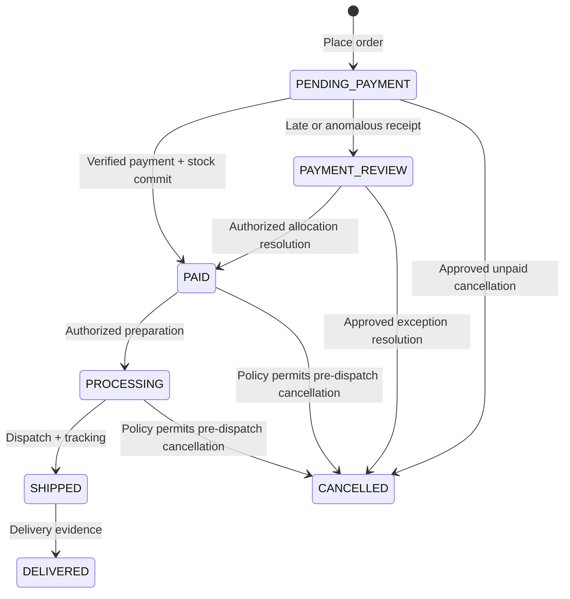

# 11 — Order state machine
Trace: FR-ORD-001–003; Q09/Q10/Q11. Operational states are distinct from payment, reservation, return and refund states.

| State | Meaning / client milestone |
|---|---|
| PENDING_PAYMENT | Order received; immutable quote accepted; may have active or expired reservation |
| PAID | Payment confirmed AND stock sale committed; eligible to prepare |
| PROCESSING | Preparing order |
| SHIPPED | Order in delivery; tracking recorded |
| DELIVERED | Delivered, evidence/time recorded |
| PAYMENT_REVIEW | Verified money needs exception resolution; no normal fulfillment authorization |
| CANCELLED | Cancellation accepted under policy; financial refund may still be pending |

No DRAFT order: cart/quote serves that purpose. REFUND_PENDING/PARTIALLY_REFUNDED/REFUNDED belong to a financial read model, not fulfillment states. Partial refunds are a representation capability only; policy approval is required before exposing that workflow.

| Transition | Actor/event | Side effects and guards |
|---|---|---|
| Create → PENDING_PAYMENT | Customer PlaceOrder | Snapshots, reservation, audit/outbox; stock and quote valid |
| PENDING_PAYMENT → PAID | Verified payment application | Unique applied receipt; commit reservation/sale; payment email event |
| PENDING_PAYMENT → PAYMENT_REVIEW | Verified mismatched/late/unallocatable receipt | Persist exception receipt and alert; no sale/dispatch |
| PENDING_PAYMENT → CANCELLED | Authorized cancellation action | Release active reservation once; policy required |
| PAYMENT_REVIEW → PAID | Owner-reviewed settlement | Valid full matching receipt, all stock allocated atomically, no conflicting applied receipt; audit reason |
| PAYMENT_REVIEW → CANCELLED | Owner resolution | Release remaining reservation; separately approve refund where money received |
| PAID → PROCESSING | Authorized order staff/owner | Verify financial hold absent; audit |
| PROCESSING → SHIPPED | Authorized dispatch actor | One shipment, valid tracking reference/link, timestamp; audit |
| SHIPPED → DELIVERED | Authorized recording actor | Delivery evidence/time; audit; return clock only if policy selects this anchor |
| PAID/PROCESSING → CANCELLED | Owner under approved policy | No prior dispatch; compensating inventory only when appropriate; refund tracked separately |

Expiration alone does not cancel the order: retry must reuse it. Failed attempts do not regress PAID orders. A late receipt for CANCELLED order is stored as an unapplied payment exception and flagged for owner action; CANCELLED is not silently reopened. Extra success for already PAID/PROCESSING/SHIPPED/DELIVERED order preserves fulfillment state, sets financial hold/review reason and prevents duplicate stock deduction; resolve overpayment independently.

Prohibited: direct customer status mutation; PENDING_PAYMENT → SHIPPED; redirect → PAID; SHIPPED → CANCELLED; DELIVERED → PROCESSING; refund → automatic inventory restock; failed webhook → paid-state rollback. A financial hold blocks preparation/dispatch until owner resolution; it does not erase already recorded delivery facts. Exceptional correction needs a reviewed audited action, not arbitrary status editing. API transitions use expected version to prevent lost updates.

Recommendations awaiting Q09/Q11: cancellation eligibility, exception resolution actors, no partial shipments and dispatch/delivery evidence requirements. Core client milestones are preserved regardless. Customer view shows both operational status and accurate payment/refund status without exposing sensitive investigation details.

## Phase 3G implementation amendment — 2026-09-23

Phase 3F is approved. [ADR-015](adr/015-checkout-order-promotion.md) now defines the implemented checkout-to-order handoff: order-owned immutable snapshots, original reservation binding, atomic promoted marker, retained cart contents, separate neutral payment state, approved unpaid cancellation and scoped initial guest capability. Only PENDING_PAYMENT/CANCELLED are executable. [Orders](../development/orders.md) and [state machine](../development/order-state-machine.md) specify current schema/API and later Phase 3H guards. Earlier generic order/outbox/payment design remains future context where explicitly superseded; no provider, shipment, return or refund implementation is included.

## Phase 3H payment extension — 2026-09-23

Phase 3G is formally approved. Its NOT_STARTED-only executable boundary is extended by [Payments](../development/payments.md): separate attempts/verified receipts, PENDING_PAYMENT → PAID or PAYMENT_REVIEW, unchanged CANCELLED history, and financial hold for late/extra money. Cart retention, original reservation lifetime, immutable commercial snapshots and cancellation only before any payment activity remain unchanged. No shipping or refunds are implemented. See the [Phase 3H report](../development/phase-3h-report.md) for current validation and provider limitations.

## Phase 3I implementation amendment — 2026-09-24

Phase 3H is formally approved as an implementation baseline; actual external Paystack verification remains a production/UAT gate. The client explicitly authorized one shipment/order, provider-neutral manual fulfilment and staff-confirmed delivery. [Shipping storage/configuration](../development/shipping.md) and [fulfilment service/API](../development/fulfilment.md) are the executable contract: PAID → PROCESSING → SHIPPED → DELIVERED; PREPARED → SHIPPED → DELIVERED shipments; existing approved staff permissions; required saved carrier, tracking number and approved HTTPS link before dispatch; required internal staff delivery evidence. The API uses intent-specific processing/ship/deliver commands plus POST/PATCH shipment preparation, superseding the earlier conceptual generic transition/PUT paths for these operations.

Shipping never recalculates checkout delivery charges or consumes inventory again. Immutable shipment history and durable fulfilment event hooks extend the staged journal approach; no notification transport, carrier adapter, post-payment cancellation, return or refund action is added. Financial holds block preparation/dispatch, but do not erase or prevent recording a delivery fact for an already shipped order. No material architecture deviation or new ADR is required. The [Phase 3I report](../development/phase-3i-report.md) records actual verification separately from pending production logistics configuration.
